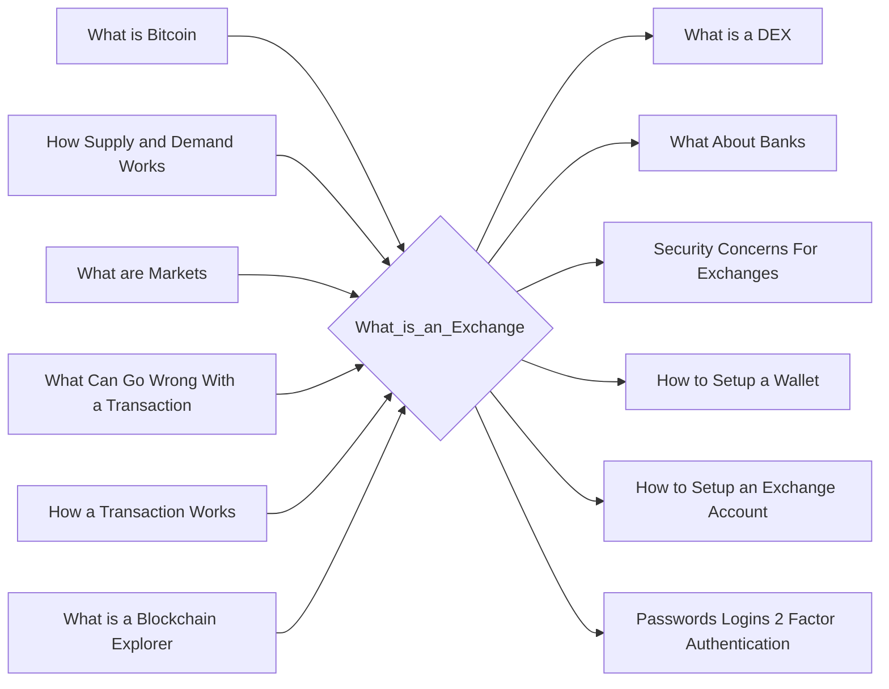

# Prerequisites
[[What_is_Bitcoin]]

[[How_Supply_and_Demand_Works]]

[[What_are_Markets]]

[[What_Can_Go_Wrong_With_a_Transaction]]

[[How_a_Transaction_Works]]

[[What_is_a_Blockchain_Explorer]]

# Subgraph

# Description
An exchange is a platform where you can buy sell or trade cryptocurrencies. Exchanges allow you to use different currencies to buy cryptocurrencies and then you can sell them for a different currency. Exchanges also allow you to trade cryptocurrencies for other cryptocurrencies.

# Links
Links to other educational resources here: