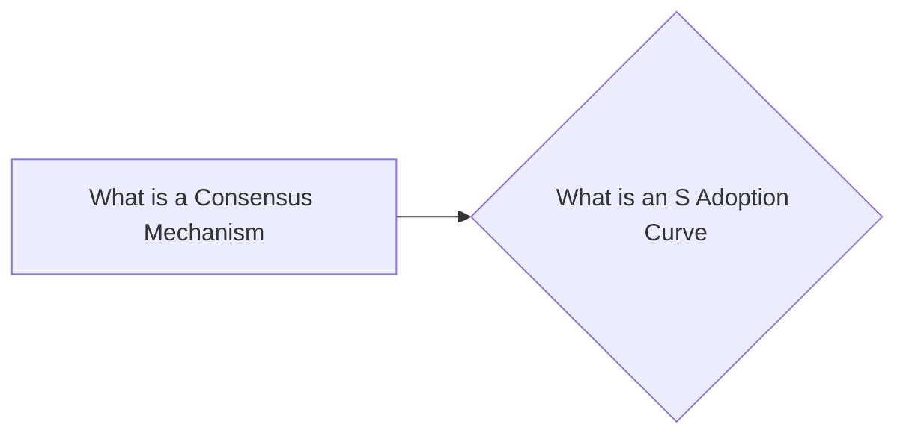

# Prerequisites
[[What_is_a_Consensus_Mechanism]]

# Subgraph

# Description
  
An S adoption curve is a graphical representation of how a technology or product is adopted over time. It typically starts with a small number of adopters and then grows exponentially as more people become interested. The S curve is often used to describe the growth of new technologies such as the internet and cryptocurrencies.

# Links
Links to other educational resources here: