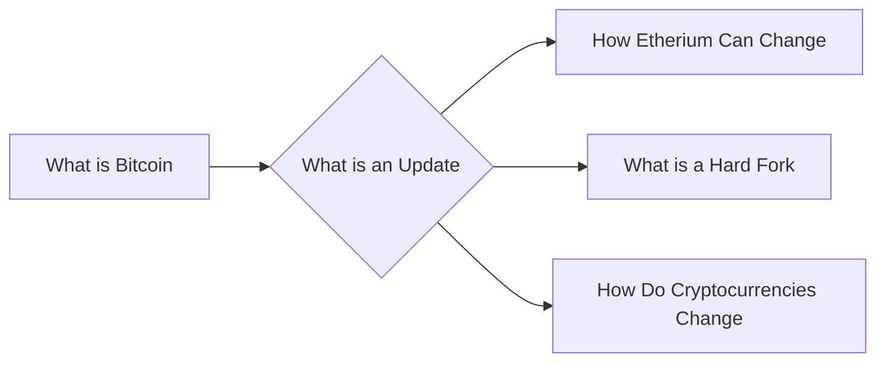

# Prerequisites
[[What_is_Bitcoin]]

# Subgraph

# Description
An update (BIPs) is a proposed change to the Bitcoin protocol. Updates are proposed by Bitcoin developers and are voted on by the Bitcoin community. If an update is accepted by the community it is implemented into the Bitcoin protocol.

# Links
Links to other educational resources here: