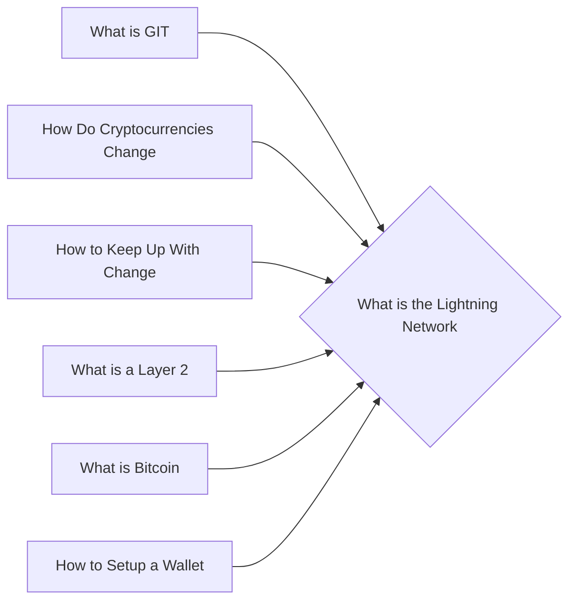

# Prerequisites
[[What_is_GIT]]

[[How_Do_Cryptocurrencies_Change]]

[[How_to_Keep_Up_With_Change]]

[[What_is_a_Layer_2]]

[[What_is_Bitcoin]]

[[How_to_Setup_a_Wallet]]

# Subgraph

# Description
The lightning network is a proposed solution to the bitcoin scalability problem. It is a second-layer payment protocol that operates on top of the bitcoin network. It allows for instant high-volume transactions without the need to wait for confirmations.

# Links
Links to other educational resources here: