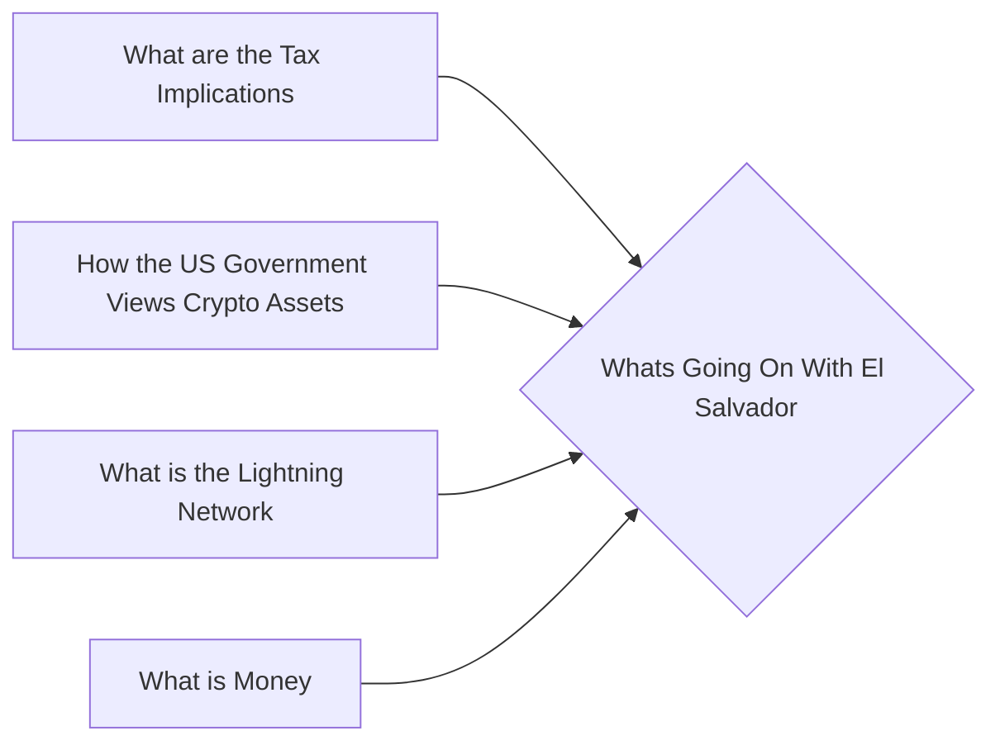

# Prerequisites
[[What_are_the_Tax_Implications]]

[[How_the_US_Government_Views_Crypto_Assets]]

[[What_is_the_Lightning_Network]]

[[What_is_Money]]

# Subgraph

# Description
  
El Salvador is in the process of creating a regulatory framework for cryptocurrencies. The government has been working on the proposal since early 2018 and is expected to release it in the coming months. The framework will likely include licensing requirements and other regulations for exchanges miners and investors.

# Links
Links to other educational resources here: