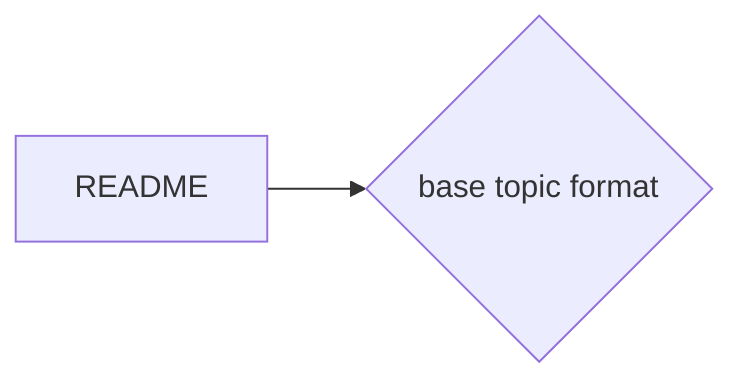

# Prerequisites
Put links to the topics that need to be covered for understanding here:
Example:
[[README]]

# Subgraph

# Description
A bit about the topic here:

# Exercises
Some things to look into or exercises to do here:

# Links
Links to other educational resources here:
