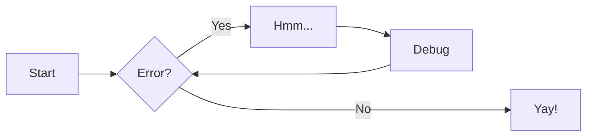
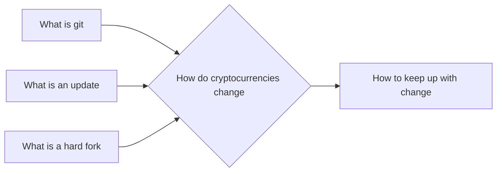
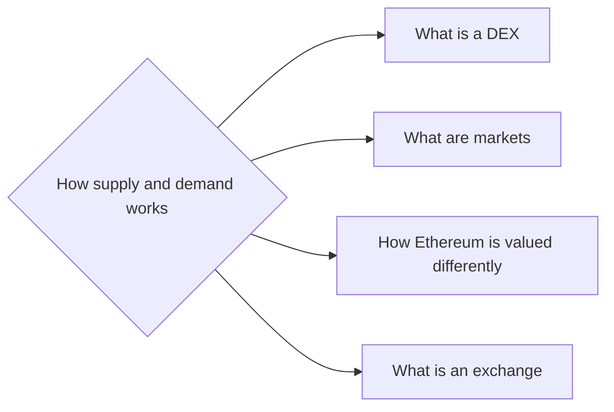

Diagram Test:

``` mermaid
graph LR
  A[Start] --> B{Error?};
  B -->|Yes| C[Hmm...];
  C --> D[Debug];
  D --> B;
  B ---->|No| E[Yay!];
```

Diagram Test Crypto:

```mermaid
graph LR
    A["What is git"]-->B{"How do cryptocurrencies change"}
    C["What is an update"]-->B
    D["What is a hard fork"]-->B
    B-->E["How to keep up with change"]
```

Test generated graph:

```mermaid
graph LR
0{"How supply and demand works"}-->1["What is a DEX"]
0{"How supply and demand works"}-->2["What are markets"]
0{"How supply and demand works"}-->3["How Ethereum is valued differently"]
0{"How supply and demand works"}-->4["What is an exchange"]
```

Destructive test:

```mermaid
graph LR
    1["What is git"]-->0{"How do cryptocurrencies change"}
    2["What is an update"]-->0{"How do cryptocurrencies change"}
    3["What is a hard fork"]-->0{"How do cryptocurrencies change"}
    0{"How do cryptocurrencies change"}-->4["How to keep up with change"]
```