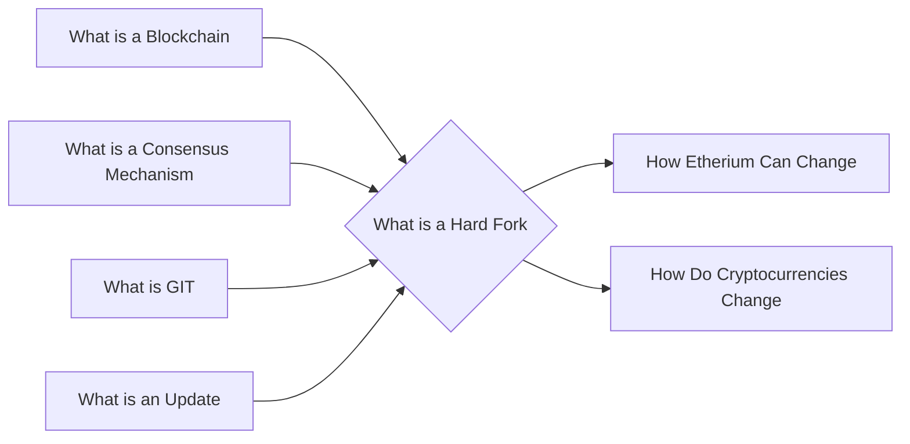

# Graph Visualization Methods
It would be cool to include a graph visualization of the notes on the web version.

## Some cool references
[plotly 3D network graph](https://plotly.com/python/v3/3d-network-graph/)

[plotly new network graphs page](https://plotly.com/python/network-graphs/)

It looks like [netlify](https://www.netlify.com/) has a nice way to generate webpages from
a collection of markdown files. 

It uses generators to create the webpages. [Jamstack](https://jamstack.org/generators/)

It looks like jamstack provides a bunch of services to generate webpages.

MKdocs looks like a good option, it is python based.

Mermaid is a graph visualization tool. It's flowchart might be a neat way to generate a little tree at the top
of a webpage to visualize the prerequisites.

## Mkdocs notes
Special characters are not supported in wikilinks names, and it doesn't look like it can drill down in paths.

For links to look correct in rendered markdown they need to have double enters behind them.

[Git repo I am basing a bunch of stuff off](https://github.com/StarfallProjects/obsidian-netlify-monorepo/tree/main/hobby-knowledge-base)

It looks like the edit feature in mkdocs won't work with the markdown files, because to maintain Obsidian compatibility
the files are renamed and stored in a different location.

Looks like wikilinks between files are broken. Maybe this guy has the solution:
https://github.com/jobindj/obsidian-publish-mkdocs

Yep, it looks like instead of using wikilinks extension you should use roamlinks plugin

It looks like you can add links to the graphs in the markdown files:
[How to add a link in a mermaid node description?](https://stackoverflow.com/questions/41960529/how-to-add-a-link-in-a-mermaid-node-description)
[Adding Hyperlinks to a Diagram (versions of Mermaid javascript >~ 8.5.0)](https://github.com/fralau/mkdocs-mermaid2-plugin#adding-hyperlinks-to-a-diagram-versions-of-mermaid-javascript--850)

Template test graph:

Working on getting the complete learning graph to look better:
%%{init: {'theme': 'dark', 'themeVariables': { 'fontSize': '100px', 'fontFamily': 'Inter'}}}%%

### Command to run mkdocs
``
mkdocs serve
``
``
mkdocs gh-deploy
``

# Design goals

- done:Make a little graph visualization on each page showing some of the prerequisites, or connections between topics.
- done:Have the website hostable on github pages.
- done:Have the website easily generated from the notes
- Have a link checker that tests all links in the website
- Make a nice logo for the top right hand corner
- done:Figure out how to make the links work correctly
- done:backlinks work if there are no prerequisites. Fix that.
- 
